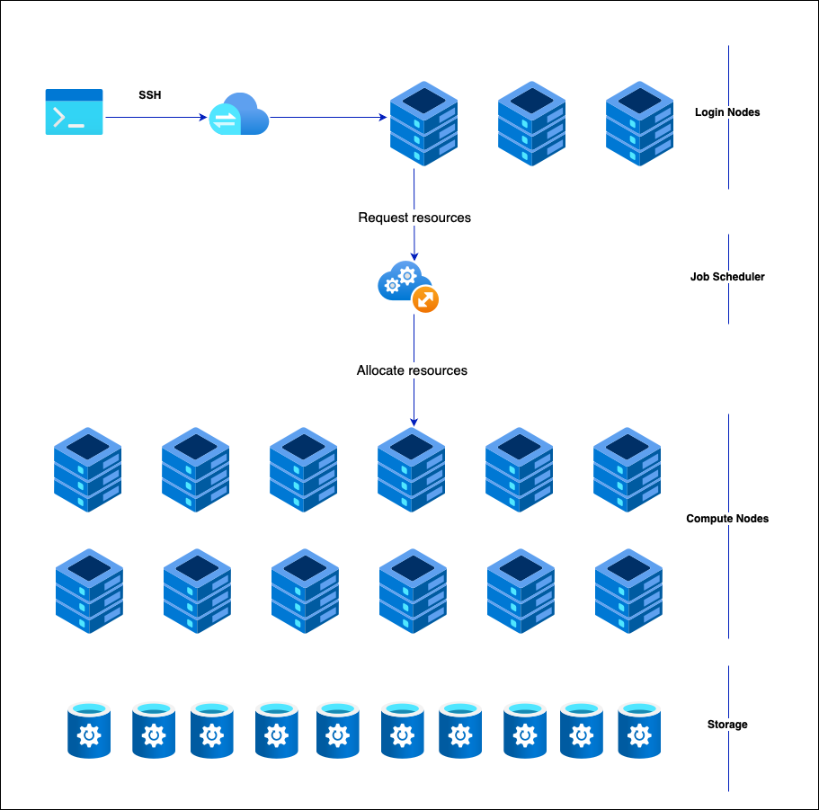

Tutorial
========

In this tutorial, we'll be using the Gadi HPC machine at NCI. A Python virtual environment will be provided for you during the session.

High-level HPC Architecture
---------------------------

In an HPC machine, nodes are provisioned by allocating compute resources from a central pool based on the job's requirements. The system uses 
job schedulers like Slurm or PBS to manage and distribute these resources efficiently. When a job is submitted, the scheduler assigns nodes with 
the necessary compute power, memory, and storage to execute the job. Nodes can be dynamically allocated or deallocated based on job demands and system load.

**Login nodes** in an HPC cluster serve as access points for users to interact with the system, allowing tasks such as code compilation, data preparation, 
and job submission. These nodes are configured with resource limits to ensure they remain responsive and are not used for heavy computations. Users connect 
to login nodes via SSH to submit and manage jobs through the scheduler, which then allocates resources from compute nodes for actual processing. While login 
nodes handle light, interactive tasks, the primary computational work occurs on separate, dedicated nodes. These nodes also play a role in maintaining system 
security and stability through regular updates and restricted access.

On the other hand, **Compute nodes** are dedicated to executing intensive computational tasks. They are equipped with powerful processors, ample RAM, and high-speed 
networking to handle large-scale data processing and parallel computations. Managed by a job scheduler, compute nodes are allocated based on job requirements 
and are dedicated to a specific job. 

**Storage nodes** in an HPC cluster are essential for managing and providing access to large volumes of data generated by computational tasks. They use various storage 
technologies, including local disks for temporary storage and networked or parallel file systems like Lustre or GPFS for scalable, high-performance data access. 
These nodes are optimized for high throughput and low latency, integrated with the cluster's networking to facilitate fast data transfer. 

Requesting a Job
****************

1.  Which project are you using?
2.  Which job queue are you planning to use?
3.  How many CPU cores are required for your task?
4.  How many GPUs do you need?
5.  What is the estimated runtime of your program?
6.  Which modules are necessary to execute the program?
7.  What script or command will you use to run the program?

.. code-block:: console
    :linenos:

    pygments_style = 'sphinx'

    #!/bin/bash

    #PBS -P vp91
    #PBS -q normal
    #PBS -l ncpus=48
    #PBS -l mem=10GB
    #PBS -l walltime=00:02:00
    #PBS -N testScript

    module load python3/3.11.0
    module load papi/7.0.1

    . /scratch/vp91/Training-Venv/intro-parallel-prog/bin/activate

    which python

* **P**     - Gadi project (sometimes called account) used
* **q**     - Gadi queue to use
* **ncpus** - Total number of cores requested
* **ngpus** - Total number of GPUs requested
* **mem**   - Total memory requested
* **l**     - Total wall time for which the resources are provisioned
* **N**     - Name of the job 

For more PBS Directives please checkout the `Gadi document <https://opus.nci.org.au/display/Help/PBS+Directives+Explained>`_  and for more details on the 
different Gadi queues plase checkout the corresponding `Gadi document <https://opus.nci.org.au/display/Help/Queue+Structure>`_ .

All the python code are available in the directory python/src while all the job scripts are available in the directory. To submit a job use 
the command

.. code-block:: console
    :linenos:

    qsub 0_testScript.pbs

and to know the status of your job use the command

.. code-block:: console
    :linenos:

    qstat <jobid>

To know get the details of the nodes allocated use the command

.. code-block:: console
    :linenos:

    qstat -swx <jobid>

.. toctree::

   tutorial/hpc_node
   tutorial/vector
   tutorial/multicore
   tutorial/multinode
   tutorial/gpu

# Reference
1. https://docs.nvidia.com/deeplearning/performance/dl-performance-gpu-background/index.html
2. https://www.nvidia.com/content/PDF/fermi_white_papers/NVIDIA_Fermi_Compute_Architecture_Whitepaper.pdf
3. https://www.sciencedirect.com/science/article/abs/pii/B978012800979600010X
4. https://developer.download.nvidia.com/CUDA/training/StreamsAndConcurrencyWebinar.pdf
5. https://mpitutorial.com

# Contributers
1. [Joseph John, Staff Scientist, NCI](https://www.josephjohn.org) \

*ChatGPT has been utilized to enhance and generate texts in this document*.

