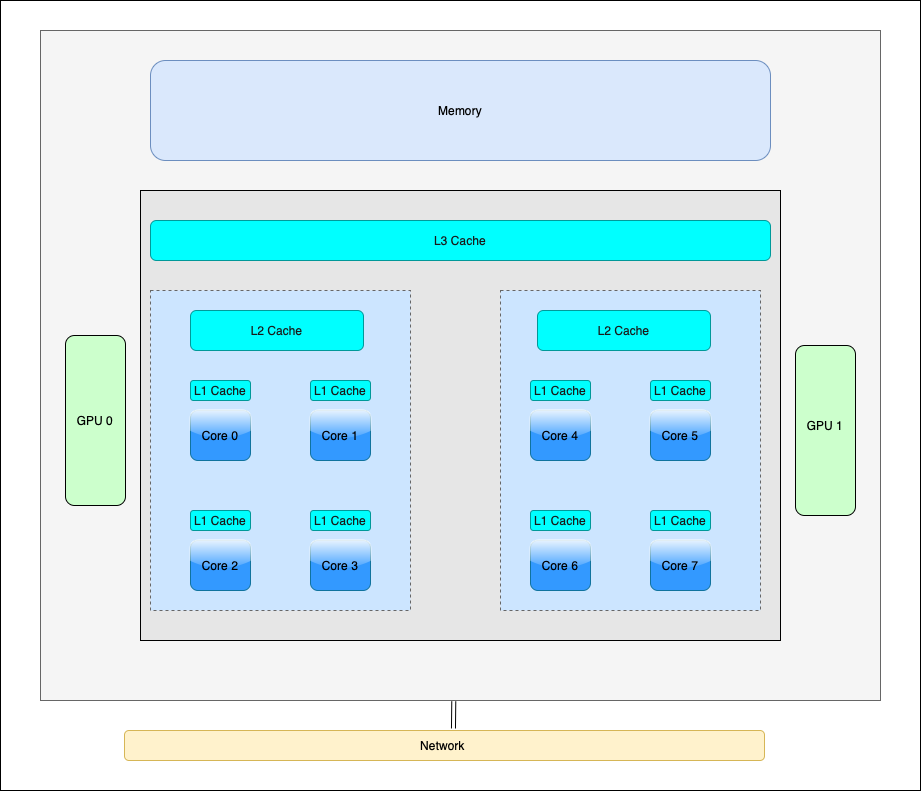
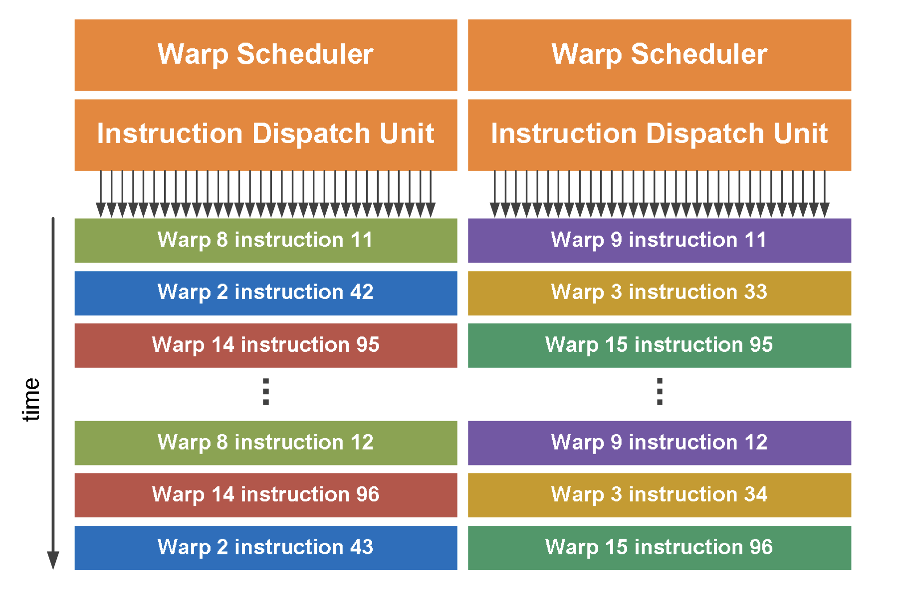
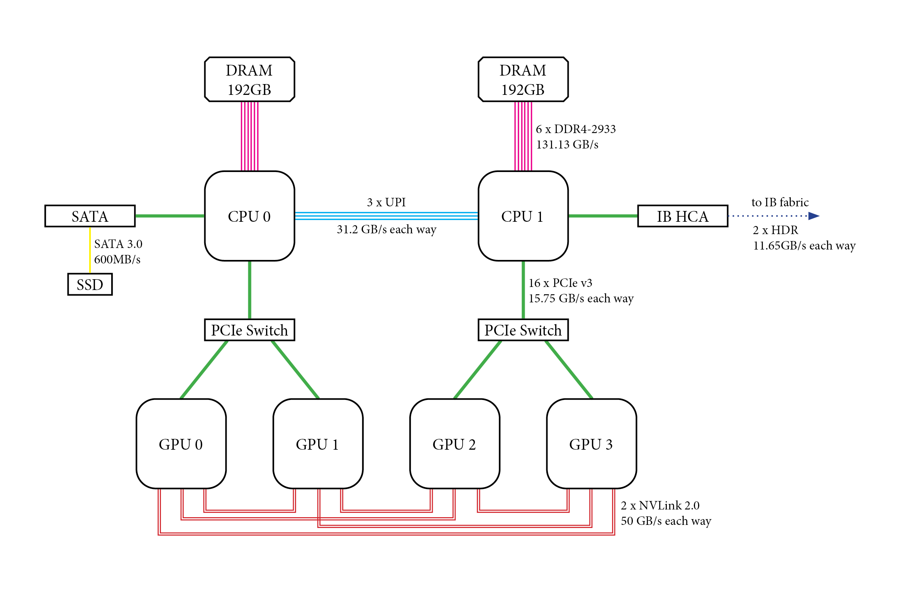

Tutorial
========

In this tutorial, we'll be using the Gadi HPC machine at NCI. A Python virtual environment will be provided for you during the session.

High-level HPC Architecture
---------------------------

In an HPC machine, nodes are provisioned by allocating compute resources from a central pool based on the job's requirements. The system uses 
job schedulers like Slurm or PBS to manage and distribute these resources efficiently. When a job is submitted, the scheduler assigns nodes with 
the necessary compute power, memory, and storage to execute the job. Nodes can be dynamically allocated or deallocated based on job demands and system load.

.. image::  figs/HPC_overview.drawio.png

**Login nodes** in an HPC cluster serve as access points for users to interact with the system, allowing tasks such as code compilation, data preparation, 
and job submission. These nodes are configured with resource limits to ensure they remain responsive and are not used for heavy computations. Users connect 
to login nodes via SSH to submit and manage jobs through the scheduler, which then allocates resources from compute nodes for actual processing. While login 
nodes handle light, interactive tasks, the primary computational work occurs on separate, dedicated nodes. These nodes also play a role in maintaining system 
security and stability through regular updates and restricted access.

On the other hand, **Compute nodes** are dedicated to executing intensive computational tasks. They are equipped with powerful processors, ample RAM, and high-speed 
networking to handle large-scale data processing and parallel computations. Managed by a job scheduler, compute nodes are allocated based on job requirements 
and are dedicated to a specific job. 

**Storage nodes** in an HPC cluster are essential for managing and providing access to large volumes of data generated by computational tasks. They use various storage 
technologies, including local disks for temporary storage and networked or parallel file systems like Lustre or GPFS for scalable, high-performance data access. 
These nodes are optimized for high throughput and low latency, integrated with the cluster's networking to facilitate fast data transfer. 

Requesting a Job
****************

1.  Which project are you using?
2.  Which job queue are you planning to use?
3.  How many CPU cores are required for your task?
4.  How many GPUs do you need?
5.  What is the estimated runtime of your program?
6.  Which modules are necessary to execute the program?
7.  What script or command will you use to run the program?

.. code-block:: console
    :linenos:

    pygments_style = 'sphinx'

    #!/bin/bash

    #PBS -P vp91
    #PBS -q normal
    #PBS -l ncpus=48
    #PBS -l mem=10GB
    #PBS -l walltime=00:02:00
    #PBS -N testScript

    module load python3/3.11.0
    module load papi/7.0.1

    . /scratch/vp91/Training-Venv/intro-parallel-prog/bin/activate

    which python

* P - Gadi project (sometimes called account as well) used
* q - Gadi queue to use
* ncpus - Total number of cores we are provisioning
* ngpus - Total number of GPUs we are provisioning
* mem - Total memory we are provisioning
* l - Total wall time for which the resources are provisioned
* N - Name of the job 

.. code-block:: console
    :linenos:

    cd python/jobScripts
    qsub 0_testScript.pbs

HPC Compute Node
****************

How does cache influence peformance?
************************************

As the data size increases, cache misses also increase, leading to performance degradation.

.. code-block:: console
    :linenos:
    
    qsub 1_cachePapi.pbs

Are you getting linear peformance for third and fourth call?

Vector Parallelism
------------------

.. image::  figs/vectorPrallelism.drawio.png

### How does vectorization influence peformance?

We will use `Numba` to vectorrize python code.

.. code-block:: console
    :linenos:
    qsub 2_vectorize.pbs

Multi-core Parallelism
----------------------

GPU Parallelism 
---------------
Gadi only has NVIDIA GPUs. So when we say GPUs we mean NVIDIA GPUs. Neveretheless, many concepts discussed here are the same across different vendors_.
While CPU is optimized to do a single operation as fast as it can (low latency operation), GPU is optimized to do large number of slow operations (high throughput operation).
GPUs  are composed of multiple Streaming Multiprocessors (SMs), an on-chip L2 cache, and high-bandwidth DRAM. The SMs execute operations and the data and code are accessed from DRAM through the L2 cache.

.. image::  figs/SM.png

Each SM is organized into CUDA cores capable of doing specialized operations.

.. image::  figs/cuda_cores.png

GPU Execution Model
*******************

Each GPU kernels are launched with a set of threads. The threads can be organized into blocks, and the blocks can be organized into a grid. The maximum number of threads a block can have will depend on the GPU generation. 

.. image::  figs/blocks.png

A block can be executed only in one SM, but an SM can have multiple blocks simultaneously. The maximum number of blocks an SM can host will depend on the GPU generation. Since an SM can execute multiple thread blocks concurrently, it is always a good idea to launch a kernel with blocks several times higher than the number of SMs. 

.. image:: figs/wave.png

**Wave** is the number of thread blocks that run concurrently. So if we have 12 SMs and we launch a kernel with 8 blocks, with an occupency of 1 block per SM, there will be two waves.

Thread Indexing
***************

Threads, blocks, and grids are organized in three dimensions: x, y, and z. For simplicity, we will use only two dimensions.

**Dimensions**:

1.  *gridDim.x* — blocks in the x dimension of the grid 
2.  *gridDim.y* — blocks in the y dimension of the grid 
3.  *blockDim.x* — threads in the x dimension of the block 
4.  *blockDim.y* — threads in the y dimension of the block 

**Indexing**: 

1.  *blockIdx.x* — block index in x dimension 
2.  *blockIdx.y* — block index in y dimension 
3.  *threadIdx.x* — thread index in x dimension 
4.  *threadIdx.y* — thread index in y dimension 

How do we assign a unique thread id to each thread using the above?
-------------------------------------------------------------------

.. image::  figs/thread_index.drawio.png

1. Find the blockId --> 
.. code-block:: console
    blockId  = (gridDim.y * blockIdx.x) + blockIdx.y

2. Using the blockId, find the threadId 
.. code-block:: console
    threadId = [(blockDim.x * blockDim.y) * blockId] + [(blockDim.y * threadIdx.x) + threadIdx.y]

Warps and Warp Schedulers
*************************

While we can arrange the threads in any order, the SM schedules the threads as **Warps**, and each warp contains 32 threads. For example, if you launch a block with 256 threads, those 256 threads are arranged as 8 warps (256/8). All the threads in the same warp can only execute the same instruction at a given time. For example, if we have a program

.. code-block:: console
    a = b + c
    d = x * y

*All* the threads in the warp should finish executing the addition operation, only then can the threads execute the multiplication operation. Depending on the generation of the GPU, it may contain more than one warp scheduler. For instance, in the *Fermi GPU*, each SM features two warp schedulers and two instruction dispatch units. This allows two warps to be issued and executed concurrently. It is always a good idea to consider the warp size (32) and the maximum number of concurrent warps possible when deciding the block size.

Data Movement in GPUs
*********************

The are two types of data movement in GPUs:

1.  Host-to-Device data movement (H2D): Move data from the host memory to the GPU memory.
2.  Device-to-Device data movement (D2D): Move data from the memory of one GPU to another.

H2D transfer happens through the PCIe switch and D2D transfer happens through NVLink. This makes D2D transfers more faster than H2D transfers.

Streams
*******

.. image::  figs/streams.png

Multi-node Parallelism
-----------------------

While all the aforementioned parallelism is beneficial, it is limited to a single node. To truly scale up an application, we need to use multiple nodes, i.e., distributed computing. The main challenge with distributed computing is that the memory in each node is distinct and separate, meaning there is no way for a thread in one node to access data in another node.

.. image::  figs/multinodePrallelism.drawio.png

We overcome this challenge by using message passing.

.. image::  figs/MPI.png

Broadcast Operation
*******************

.. image::  figs/bcast.png

### GPU-aware MPI and All-Gather Operation

.. image:: figs/allgather.png

# Reference
1. https://docs.nvidia.com/deeplearning/performance/dl-performance-gpu-background/index.html
2. https://www.nvidia.com/content/PDF/fermi_white_papers/NVIDIA_Fermi_Compute_Architecture_Whitepaper.pdf
3. https://www.sciencedirect.com/science/article/abs/pii/B978012800979600010X
4. https://developer.download.nvidia.com/CUDA/training/StreamsAndConcurrencyWebinar.pdf
5. https://mpitutorial.com

# Contributers
1. [Joseph John, Staff Scientist, NCI](https://www.josephjohn.org) \

*ChatGPT has been utilized to enhance and generate texts in this document*.

