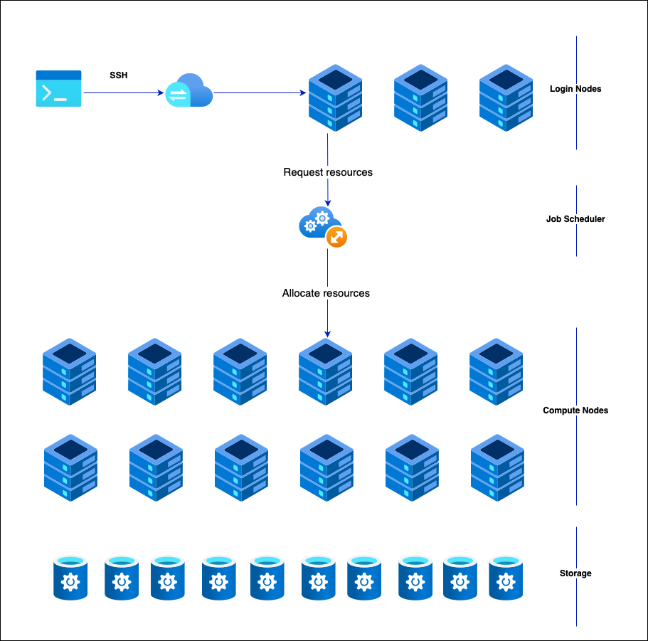
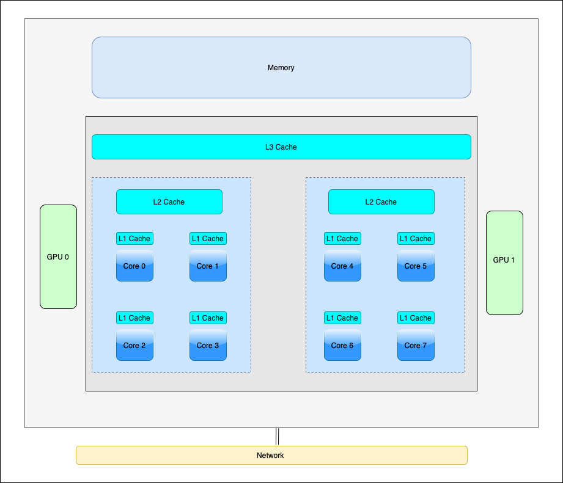

High-level HPC Architecture
---------------------------

.. admonition:: Overview
   :class: Overview

    * **Tutorial:** 20 min
    * **Exercises:** 5 min

        **Objectives:**
            #. Learn how HPC machines are generally organized.
            #. Learn how *Cache* influence performance.

In an HPC machine, nodes are provisioned by allocating compute resources from a central pool based on the job's 
requirements. The system uses job schedulers like Slurm or PBS to manage and distribute these resources 
efficiently. When a job is submitted, the scheduler assigns nodes with the necessary computing power, memory, 
and storage to execute the job. Nodes can be dynamically allocated or deallocated based on job demands and 
system load.

**Login nodes** in an HPC cluster serve as access points for users to interact with the system, allowing tasks 
such as code compilation, data preparation, and job submission. These nodes are configured with resource limits 
to ensure they remain responsive and are not used for heavy computations. Users connect to login nodes via SSH 
to submit and manage jobs through the scheduler, which then allocates resources from compute nodes for actual 
processing. While login nodes handle light, interactive tasks, the primary computational work occurs on separate,
dedicated nodes. These nodes also play a role in maintaining system security and stability through regular 
updates and restricted access.

On the other hand, **Compute nodes** are dedicated to executing intensive computational tasks. They are equipped 
with powerful processors, ample RAM, and high-speed networking to handle large-scale data processing and parallel
computations. Managed by a job scheduler, compute nodes are allocated based on job requirements and are dedicated
to a specific job. 

**Storage nodes** in an HPC cluster are essential for managing and providing access to large volumes of data 
generated by computational tasks. They use various storage technologies, including local disks for temporary 
storage and networked or parallel file systems like Lustre or GPFS for scalable, high-performance data access. 
These nodes are optimized for high throughput and low latency, and integrated with the cluster's networking to 
facilitate fast data transfer. 

HPC Compute Node
****************

A cache is a small, high-speed storage component used to temporarily hold frequently accessed data or 
instructions (`temporal locality <https://www.sciencedirect.com/topics/computer-science/temporal-locality>`_ ) 
to improve system performance. Its primary purpose is to reduce the time it takes for a processor to access 
data from the main memory (RAM) or other slower storage devices.

L1, L2, and L3 caches are hierarchical levels of CPU cache designed to speed up data access and improve 
overall processing performance:

- **L1 Cache**: This is the smallest and fastest cache level, located directly on the CPU chip. It typically 
includes separate caches for instructions (L1i) and data (L1d). Due to its proximity to the CPU cores, 
it provides the quickest access to frequently used data and instructions, but it has limited capacity.

- **L2 Cache**: Larger than L1 but slower, the L2 cache is also located on the CPU chip or very close to it. 
It serves as an intermediary between the fast L1 cache and the slower L3 cache or main memory. It holds data 
and instructions that are not immediately needed by L1 but are accessed frequently enough to justify faster 
access than the main memory.

- **L3 Cache**: This is the largest and slowest of the three caches, typically shared among multiple CPU cores. 
It acts as a last-level cache before data is fetched from the main memory. The L3 cache improves performance 
by storing a larger amount of data that is likely to be used by multiple cores, thus reducing the number of 
memory accesses and potential bottlenecks.

Together, these cache levels balance speed and capacity to enhance CPU performance by minimizing data access 
times.

How do you figure out the node architecture?
********************************************

The `lstopo` command is part of the hwloc (Hardware Locality) toolset and provides a graphical or textual 
representation of the hardware topology of a computer system. It visualizes the hierarchical structure of 
CPUs, memory, caches, and other hardware components. You can use it to understand how hardware resources 
are organized and how they relate to each other, which can be useful for performance optimization and system 
diagnostics.

.. code-block:: console
    :linenos:

    module load papi/7.0.1
    lstopo

How does cache influence performance?
************************************

In the context of caching, **cache hit** and **cache miss** refer to the outcomes of a cache lookup operation:

- **Cache Hit**: A cache hit occurs when the data or instruction requested by the CPU is found in the cache. 
This means the cache contains a copy of the data that is needed, allowing the CPU to access it quickly and avoid 
fetching it from the slower main memory. Cache hits improve performance by reducing access time and latency.

- **Cache Miss**: A cache miss happens when the requested data or instruction is not found in the cache. In this 
case, the system must retrieve the data from the main memory or another slower storage medium. After fetching 
the data, it is typically stored in the cache for future use. Cache misses can result in slower access times 
since the data must be retrieved from a less efficient source.

Overall, maximizing cache hits and minimizing cache misses are key strategies for optimizing system performance 
and efficiency. Also, as the data size increases, cache misses also increase, leading to performance degradation.

.. code-block:: console
    :linenos:
    
    qsub 1_cachePapi.pbs

Are you getting linear performance for third and fourth calls?

.. admonition:: Key Points
   :class: hint

    #. There are different levels to an HPC machine.
    #. Cache misses can influence peformance.