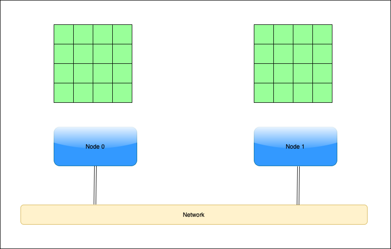
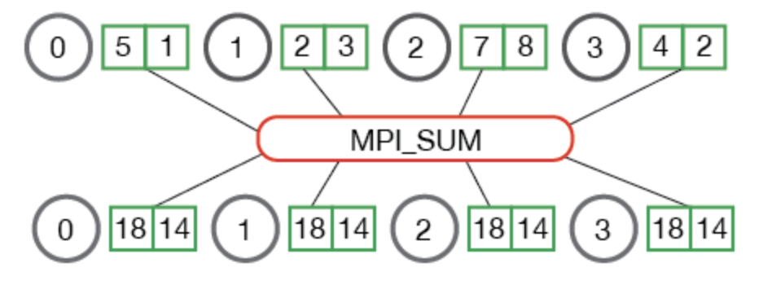

Multi-node Parallelism
-----------------------

.. admonition:: Overview
   :class: Overview

    * **Tutorial:** 20 min
    * **Exercises:** 5 min

        **Objectives:**
            #. Learn about distributed computing using message passing.
            #. Learn about the **Broadcast** operation in MPI.
            #. Learn about the **Gather** operation in MPI.

While all the aforementioned parallelisms are beneficial, it is limited to a single node. To truly scale up an 
application, we need to use multiple nodes, i.e., distributed computing. The main challenge with distributed 
computing is that the memory in each node is distinct and separate, meaning there is no way for a thread in 
one node to access data in another node.

We overcome this challenge by using message passing. The **Message Passing Interface (MPI)**, is a standardized 
and portable communication protocol used in parallel computing. It enables different processes, possibly running 
on different machines in a distributed system, to communicate and coordinate their actions by sending and 
receiving messages. MPI is widely used for developing parallel applications and is designed to handle tasks 
ranging from simple data exchange to complex inter-process communication in high-performance computing (HPC) 
environments. Its key features include support for both point-to-point and collective communications, process 
synchronization, and fault tolerance.

.. image:: ../figs/MPI.png

Broadcast Operation
*******************

The **MPI broadcast operation** is a collective communication function in MPI that allows one process, 
known as the "root" process, to send a message to all other processes in a communicator. Essentially, 
the root process "broadcasts" a message to every other process in the group, ensuring that each process 
receives the same data. 

.. image:: ../figs/bcast.png

This operation is often used to distribute initial data or configuration information 
to all processes participating in a parallel computation. The broadcast operation helps in synchronizing data 
across multiple processes efficiently.

GPU-aware MPI and All-Gather Operation
**************************************

The **MPI Allgather** operation is a collective communication function in MPI that allows all processes in a 
communicator to exchange and collect data from every other process. Specifically, each process sends its data 
to all other processes, and in return, each process receives the combined data from every other process. 
This results in each process having a complete view of the data from all processes in the communicator. 

The MPI Allgather operation is useful for scenarios where every process needs to access or aggregate information 
from all other processes, such as in parallel data processing and aggregation tasks.

.. admonition:: Key Points
   :class: hint

    #. MPI is an effective tool for distributed computating
    #. Message passing incurs communication cost.
