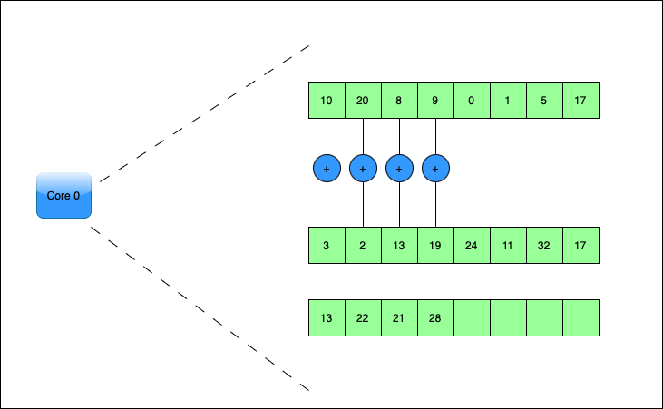

Vector Parallelism
------------------

.. admonition:: Overview
   :class: Overview

    * **Tutorial:** 20 min
    * **Exercises:** 5 min

        **Objectives:**
            #. Learn about vector parallelism.

What is vectorization?
**********************

Vectorization is a technique used in computer architecture and programming to enhance performance by processing 
multiple data points with a single instruction - *SIMD (Single Instruction, Multiple Data) instructions*. 

A core is an individual processing unit within a CPU, each capable of executing instructions independently.

How does vectorization influence peformance?
*******************************************

Vector processors are specialized hardware designed to handle vector operations. 

#. **Increased Throughput**: By processing multiple data elements per instruction, vectorization can significantly speed up computations.
#. **Efficiency**: Reduces the number of instructions needed, leading to more efficient use of the CPU.

The effectiveness of vector parallelism depends on the *vector length*, which is the number of data elements a 
vector processor can handle in parallel.

We will use `Numba <https://numba.readthedocs.io/en/stable/>`_ to vectorize python code.

Exercise
*********

How much speedup do you get from vectorization?

.. code-block:: console
    :linenos:
    qsub 2_vectorize.pbs

.. admonition:: Key Points
   :class: hint

    #. Vector parallelism can improve the peformance of the application.
    #. Vector length decides the limit of vector parallelism.
    #. Numba provides an easy way to vectorize code in Python.