# Introduction to Parallel Programming Using Python
This repository provides an introduction to the concepts of parallel programming using Python.

Learning outcomes of the tutorial are:
1. Learn the basic concepts of parallel programming.
2. Learn the different hardware components that make up an HPC machine. 
3. Learn how an HPC machine is organized.
4. Learn how to submit a Job to a PBS batch scheduler. 

Prerequisite:
1. Experience with Python.
2. Experience with bash or similar Unix shells.

Modules:
1. python3/3.11.0
2. papi/7.0.1
3. openmpi/4.0.1
4. cuda/12.3.2

Python Packages (in order of installation):
1. python-papi
2. numpy
3. codetiming
4. numba
5. mpi4py


## High-level HPC Architecture

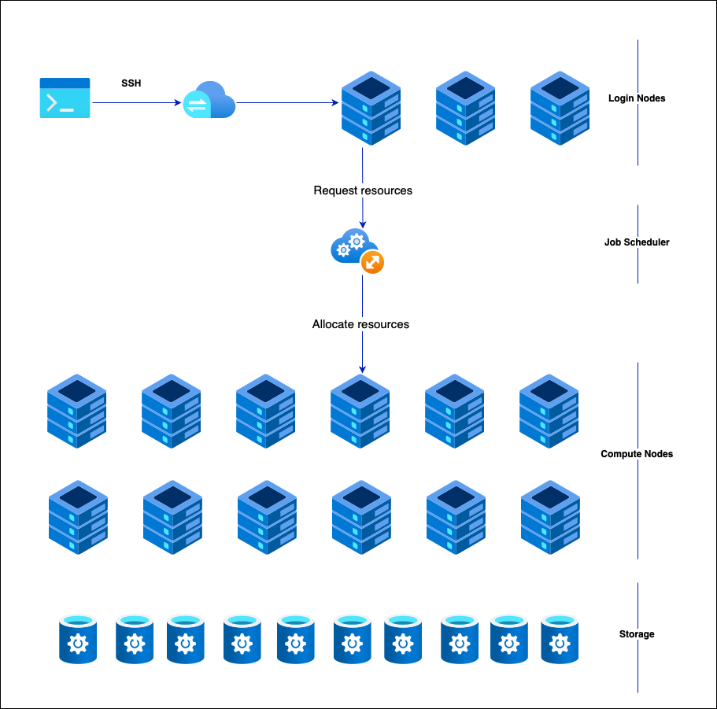

### Requesting a Job

1. Which project are you using?
2. Which job queue are you planning to use?
3. How many CPU cores are required for your task?
4. How many GPUs do you need?
5. What is the estimated runtime of your program?
6. Which modules are necessary to execute the program?
7. What script or command will you use to run the program?

```

#!/bin/bash

#PBS -P vp91
#PBS -q normal

#PBS -l ncpus=48
#PBS -l mem=10GB
#PBS -l walltime=00:02:00

#PBS -N testScript


module load python3/3.11.0
module load papi/7.0.1

. /scratch/vp91/Training-Venv/intro-parallel-prog/bin/activate

which python

```

```
cd python/jobScripts
qsub 0_testScript.pbs
```


## HPC Compute Node

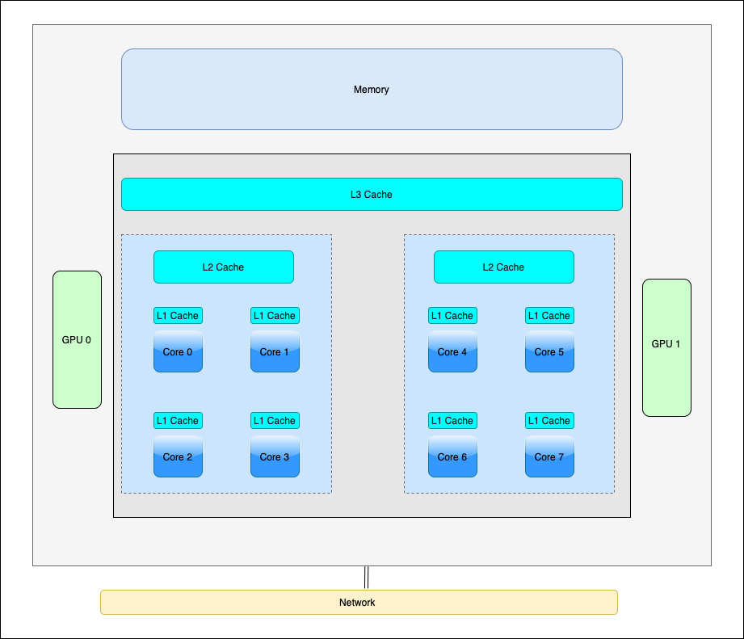

## How does *Cache* influence peformance?

As the data size increases, cache misses also increase, leading to performance degradation.

```
qsub 1_cachePapi.pbs
```

Are you getting linear performance for a third and fourth call?


## Vector Parallelism

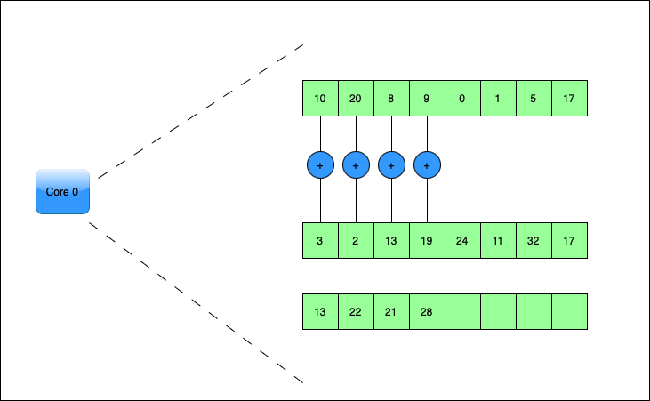

### How does vectorization influence performance?

We will use `Numba` to vectorize Python code.

```
qsub 2_vectorize.pbs
```

## Multi-core Parallelism

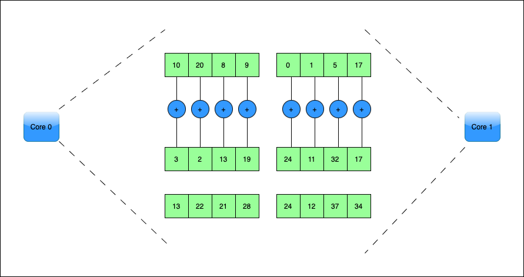


## GPU Parallelism 

_Gadi only has NVIDIA GPUs. So when we say GPUs we mean NVIDIA GPUs. Nevertheless, many concepts discussed here are the same across different vendors_.

While the CPU is optimized to do a single operation as fast as it can (low latency operation), the GPU is optimized to do a large number of slow operations (high throughput operation).

GPUs are composed of multiple Streaming Multiprocessors (SMs), an on-chip L2 cache, and high-bandwidth DRAM. The SMs execute operations and the data and code are accessed from DRAM through the L2 cache.

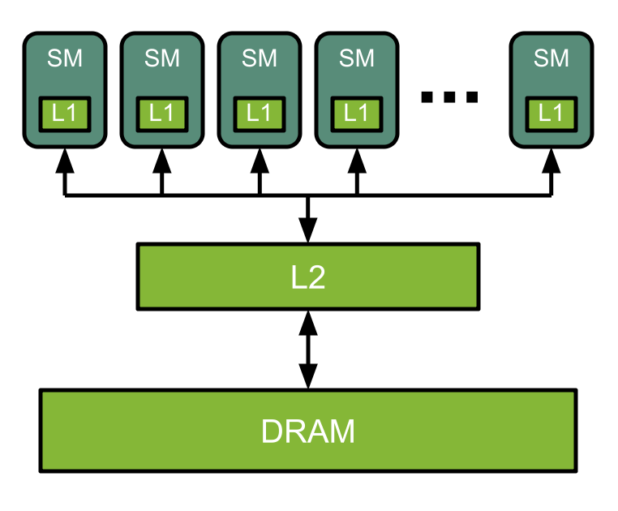

Each SM is organized into CUDA cores capable of doing specialized operations.

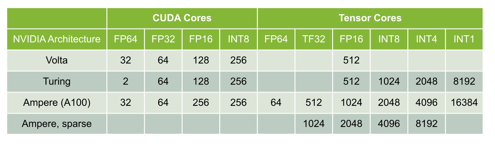

### GPU Execution Model

Each GPU kernels are launched with a set of threads. The threads can be organized into blocks, and the blocks can be organized into a grid. The maximum number of threads a block can have will depend on the GPU generation. 

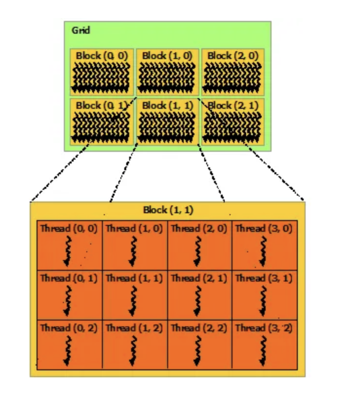

A block can be executed only in one SM, but an SM can have multiple blocks simultaneously. The maximum number of blocks an SM can host will depend on the GPU generation. Since an SM can execute multiple thread blocks concurrently, it is always a good idea to launch a kernel with blocks several times higher than the number of SMs. 

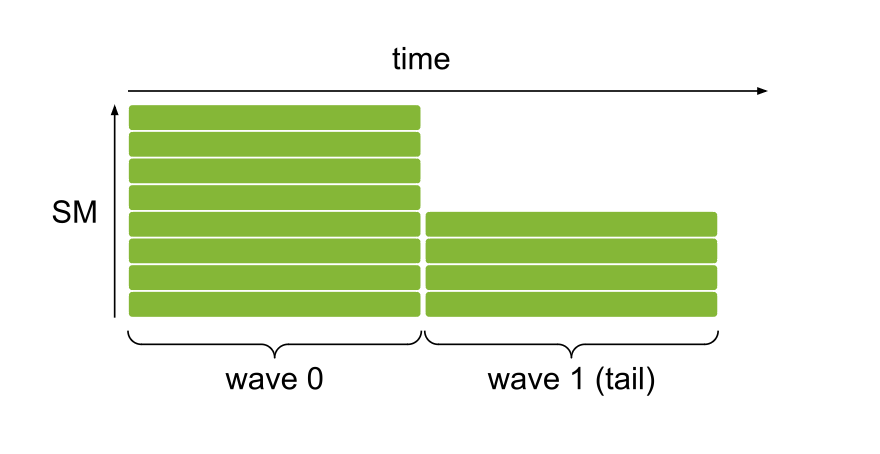

**Wave** is the number of thread blocks that run concurrently. So if we have 12 SMs and we launch a kernel with 8 blocks, with an occupancy of 1 block per SM, there will be two waves.


### Thread Indexing

Threads, blocks, and grids are organized in three dimensions: x, y, and z. For simplicity, we will use only two dimensions.

**Dimensions**: \
*gridDim.x* — blocks in the x dimension of the grid \
*gridDim.y* — blocks in the y dimension of the grid \
*blockDim.x* — threads in the x dimension of the block \
*blockDim.y* — threads in the y dimension of the block \

**Indexing**: \
*blockIdx.x* — block index in x dimension \
*blockIdx.y* — block index in y dimension \
*threadIdx.x* — thread index in x dimension \
*threadIdx.y* — thread index in y dimension \

### How do we assign a unique thread id to each thread using the above?

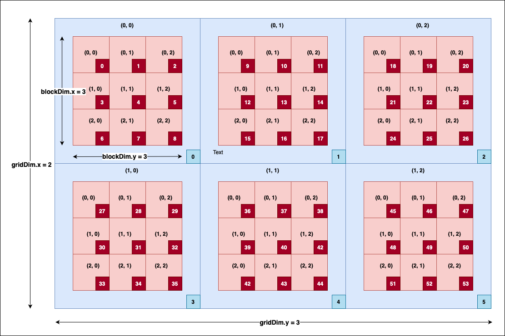


1. Find the blockId --> 
```
blockId  = (gridDim.y * blockIdx.x) + blockIdx.y
```
2. Using the blockId, find the threadId 
```
 threadId = [(blockDim.x * blockDim.y) * blockId] + [(blockDim.y * threadIdx.x) + threadIdx.y]
 ```

### Warps and Warp Schedulers

While we can arrange the threads in any order, the SM schedules the threads as **Warps**, and each warp contains 32 threads. For example, if you launch a block with 256 threads, those 256 threads are arranged as 8 warps (256/8). All the threads in the same warp can only execute the same instruction at a given time. For example, if we have a program

```
a = b + c
d = x * y
```

*All* the threads in the warp should finish executing the addition operation, only then can the threads execute the multiplication operation. Depending on the generation of the GPU, it may contain more than one warp scheduler. For instance, in the *Fermi GPU*, each SM features two warp schedulers and two instruction dispatch units. This allows two warps to be issued and executed concurrently. It is always a good idea to consider the warp size (32) and the maximum number of concurrent warps possible when deciding the block size.

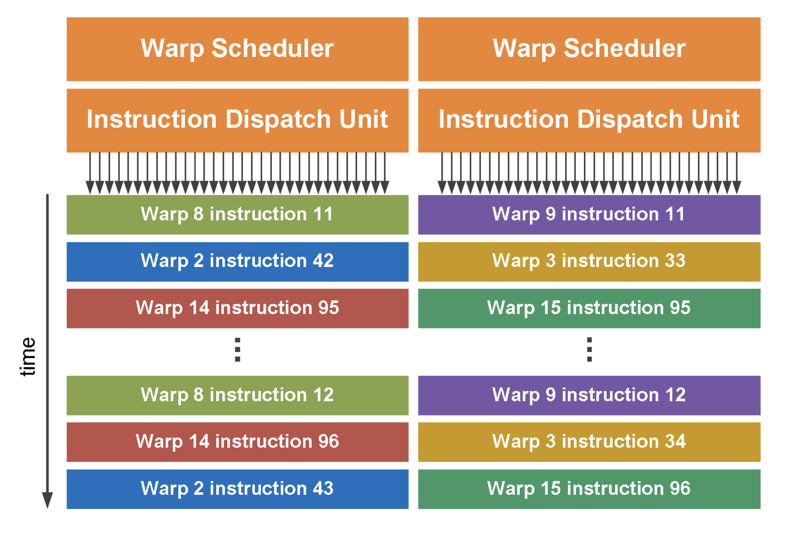

## Data Movement in GPUs

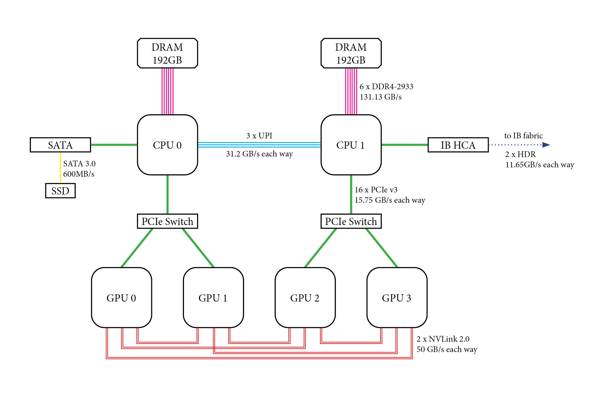

The are two types of data movement in GPUs:
1. Host-to-Device data movement (H2D): Move data from the host memory to the GPU memory.
2. Device-to-Device data movement (D2D): Move data from the memory of one GPU to another.

H2D transfer happens through the PCIe switch and D2D transfer happens through NVLink. This makes D2D transfers more faster than H2D transfers.


## Multi-node Parallelism

While all the aforementioned parallelism is beneficial, it is limited to a single node. To truly scale up an application, we need to use multiple nodes, i.e., distributed computing. The main challenge with distributed computing is that the memory in each node is distinct and separate, meaning there is no way for a thread in one node to access data in another node.

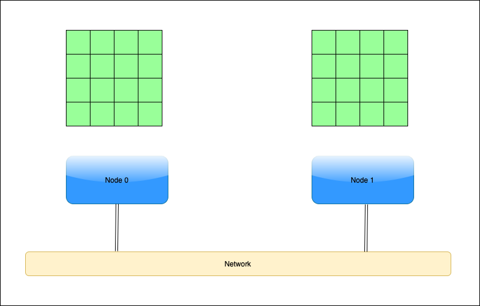

We overcome this challenge by using message passing.

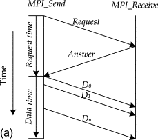

# Referneces
1. https://docs.nvidia.com/deeplearning/performance/dl-performance-gpu-background/index.html
2. https://www.nvidia.com/content/PDF/fermi_white_papers/NVIDIA_Fermi_Compute_Architecture_Whitepaper.pdf
3. https://www.sciencedirect.com/science/article/abs/pii/B978012800979600010X


# Contributers
1. [Joseph John, Staff Scientist, NCI](https://www.josephjohn.org) 

*ChatGPT has been utilized to enhance the texts in this document*.